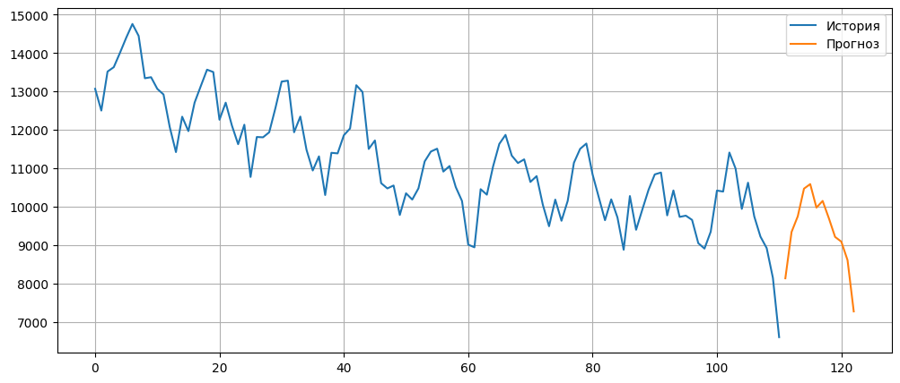

# Задача 1. Прогнозирование посещаемости сервиса на 12 месяцев

Ход решения в файле [task2.1.ipynb](task2.1.ipynb)

---

Для прогнозирования количества посещений сервиса (`target`) была использована модель линейной регрессии (`LinearRegression`).

Для повышения качества прогноза были добавлены лаговые признаки:

* `lag1` — значение целевой переменной за предыдущий месяц;
* `lag12` — значение целевой переменной за аналогичный месяц предыдущего года.

Также была построена отдельная модель линейной регрессии для прогнозирования признака `c1`, который использовался при построении итогового прогноза.

Качество модели на валидационной выборке:  
MAE = 567.42  
MAPE = 6.40%

В результате получен прогноз посещаемости сервиса на следующие 12 месяцев.

## Результат

| Год  | Месяц | Прогнозируемое количество посещений |
| ---- | ----- | ----------------------------------: |
| 2025 | 4     |                            8 141.79 |
| 2025 | 5     |                            9 346.52 |
| 2025 | 6     |                            9 755.10 |
| 2025 | 7     |                           10 473.89 |
| 2025 | 8     |                           10 592.11 |
| 2025 | 9     |                            9 980.88 |
| 2025 | 10    |                           10 154.40 |
| 2025 | 11    |                            9 703.18 |
| 2025 | 12    |                            9 218.18 |
| 2026 | 1     |                            9 095.81 |
| 2026 | 2     |                            8 615.46 |
| 2026 | 3     |                            7 280.29 |

---

# Задачи 2, 3

Решение в файле [task2.2.-2.3.ipynb](tasks2.2-2.3.ipynb)

# Задача 4

Запрос в файле [task2.3.sql](task2.4.sql)
